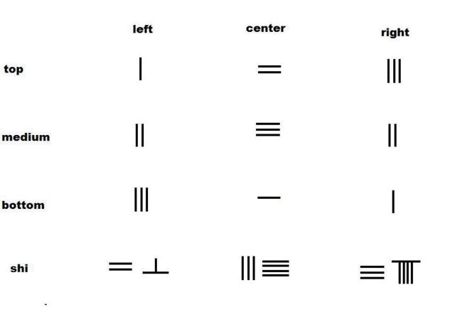

## **Introduction**

Linear Algebra is the field of study in mathematics that is concerning linear equations such as:

---
# $a_1x_1 + a_2x_2 + ... + a_nx_n = b$

The subject of Linear Algebra centers in solving the systems of (algebraic) linear equations. The term "Linear equations" is commonly used to "linearize" other mathematical objects by reducing or expanding the object into space with linear properties.
 
 

## **History**

1. The first appereance of a method that is used to solve simultaneous linear equations in Linear Algebra (Nowadays is called "Gaussian Elimination") can be trace way back to the ancient Chinese mathematial text "[Chapter Eight: Rectangular Arrays of The Nine Chapters on the Mathematical Art](https://en.wikipedia.org/wiki/Rod_calculus#System_of_linear_equations)".
    
    ###### Method of elimination by Jiuzhang Suanshu to solve problem 8-1 in Chapter Eight Rectangular Arrays: 
    
 
 

2. Systems of linear equations first arose in Europe with the introduction of coordinates in geometry in 1637 by  René Descartes.

    ###### Cortesian Coordinate System:
    
 
 

## Application of Linear Algebra
 

### Solve the following system of linear equations for x, y, and z:
### $x + 2y + z = 12$
### $2x - y + z = 1$
### $x + y - 3z = -4$
 

Problems like the above example shows up in all forms of mathematics, science, and engineering, hence it gives Linear Algebra a very broad spectrum of application.
 
 

## Sources:

* Wikipedia: https://en.wikipedia.org/wiki/Linear_algebra
* Wikipedia: https://en.wikipedia.org/wiki/Rod_calculus#System_of_linear_equations
* By Gisling - Own work, CC BY 3.0, https://commons.wikimedia.org/w/index.php?curid=10459057
* By Cronholm144 - Own work, Public Domain, https://commons.wikimedia.org/w/index.php?curid=2277021
* Brilliant "Linear Algebra" course: https://brilliant.org/wiki/linear-algebra/